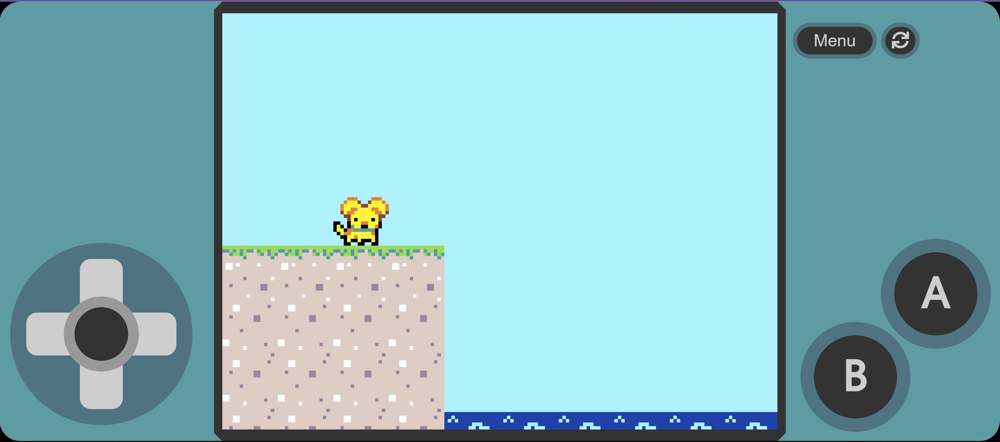
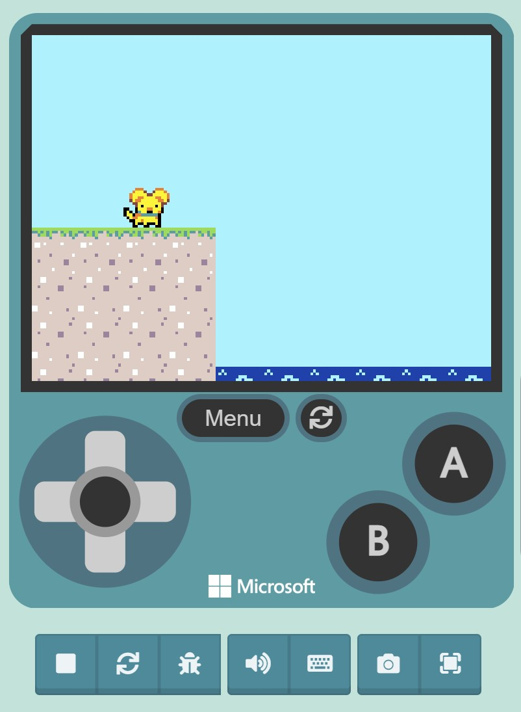
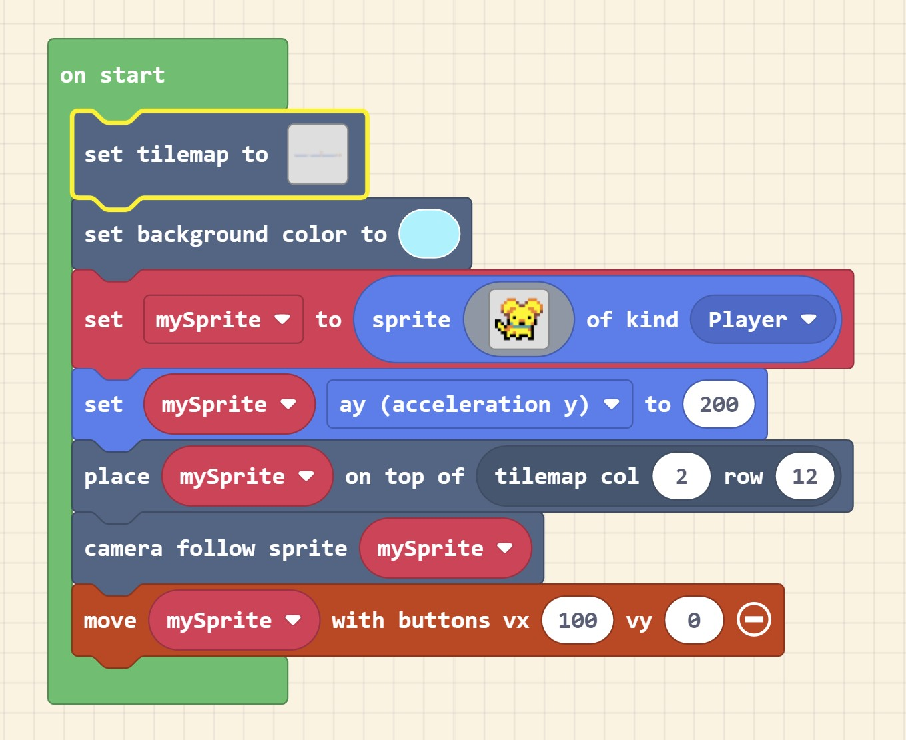
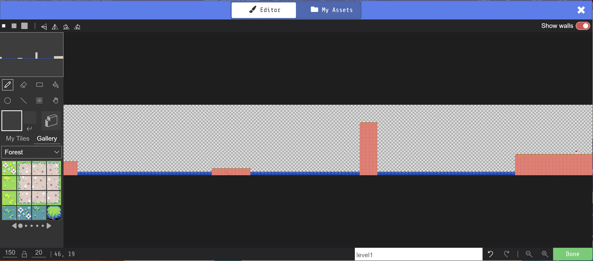
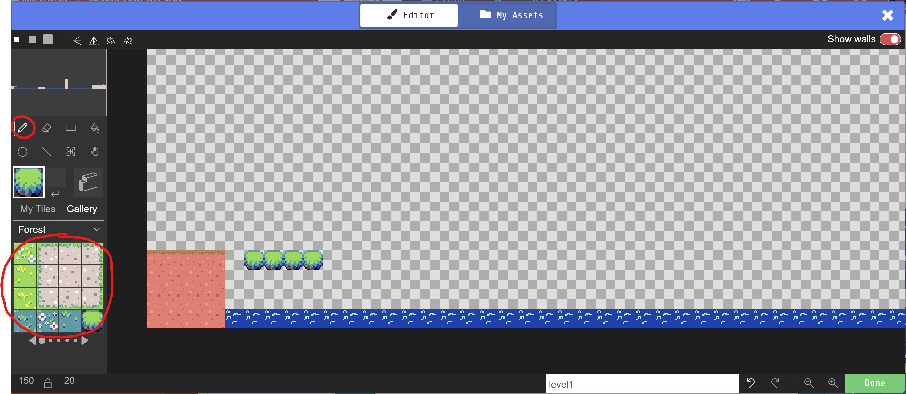
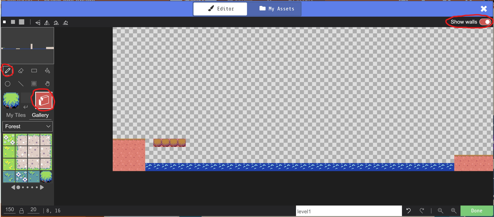
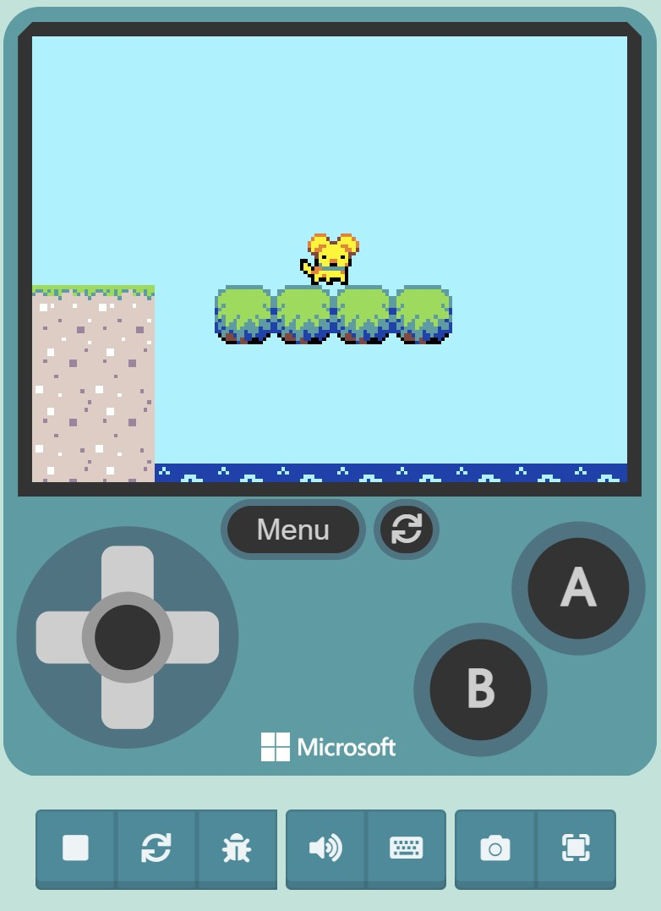
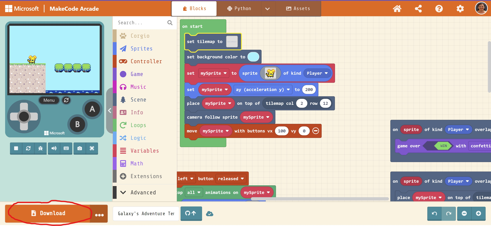

 
# Galaxy's Adventure Template

> View template at [https://bschoun.github.io/galaxys-adventure-template/](https://bschoun.github.io/galaxys-adventure-template/)

> View sample level at [https://bschoun.github.io/galaxys-adventure-sample-level/](https://bschoun.github.io/galaxys-adventure-sample-level/)

In this tutorial, you will create basic platformer level for the CHCO game Galaxy's Adventure! The goal is to set up a level so that one of our favorite CHCO Medical Dogs, Galaxy, can cross the water and get to the flag.

### Learning Goals:
* Become familiar with MakeCode Arcade
* Learn how to set up a tilemap
* Basic exposure to game design concepts

<!--## Use as Extension

This repository can be added as an **extension** in MakeCode.

* open [https://arcade.makecode.com/](https://arcade.makecode.com/)
* click on **New Project**
* click on **Extensions** under the gearwheel menu
* search for **https://github.com/bschoun/galaxys-adventure-template** and import-->

## Step 1: Set up the project <!---->

To edit this repository in MakeCode:

* open [https://arcade.makecode.com/](https://arcade.makecode.com/)
* click on **Import** then click on **Import URL**
* paste **https://github.com/bschoun/galaxys-adventure-template** and click import

## Step 2: Try the emulator

After opening the project, you should see a game controller emulator that looks like this: 

Try using the emulator controls to move left and right (joystick) and to jump ('A' button). You can also use WASD keys for movement and the space bar to jump. 

Try jumping into the water. What happens?

## Step 3: Create a level

To create a custom level, we're going to edit the tilemap. Tilemaps allow you to develop levels, and define playspaces for the characters in your games to roam around.

### 3.1 Open the tilemap

Take a look at the blocks in the project. Find the block called `on start`. This block defines how the game is set up, such as what the level looks like, what Galaxy looks like, and how Galaxy moves.

Find the block inside `on start` called `set tilemap to`. Click the square in this block. This will open up the tilemap. It should look like this:

The tilemap is the layout for the entire level. Galaxy starts on the left side of the tilemap, and needs to get all the way to the flag on the right side. However, as you may have noticed, Galaxy can't jump far enough to get to the next block. Let's add to this level so Galaxy can get to the flag!

### 3.2 Drawing platforms

Let's first add a platform Galaxy can jump on. In the tilemap editor, select the Paint Tool (pencil icon), select the tile you want to draw, and draw a platform near where Galaxy starts.

### 3.3 Adding walls

If you run the game and jump on the platform now, Galaxy still falls in the water. We need to add walls to allow Galaxy to walk on top of the platform.

In the tilemap editor, make sure the Paint Tool (pencil icon) is still selected, and click the Draw Walls icon (3D block). Make sure that the "Show walls" toggle is on. Draw walls on your platform.

Now if you run the game, Galaxy should be able to jump on the platform! 

### 3.4 Completing the level

Draw several more platforms with walls to allow Galaxy to move through the level. Try not to make it too difficult for players, but also not too easy!

## Step 4: Put it on hardware

### 4.1 Download your project

In the main window, click the download button. Select your device from the options (probably Meowbit). This will download a .uf2 file.

### 4.2 Uploading your .uf2 file

Make sure the Meowbit is off and plug it into your computer. Hold down the 'A' button on the Meowbit while turning it on. This will open a folder with the device files. Drag the .uf2 file you downloaded into this folder. 

### 4.3 Test your game

That's it! The game should now be running on the device, and you can unplug it from the computer.